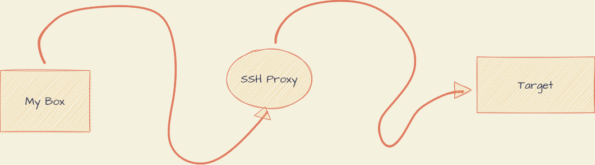
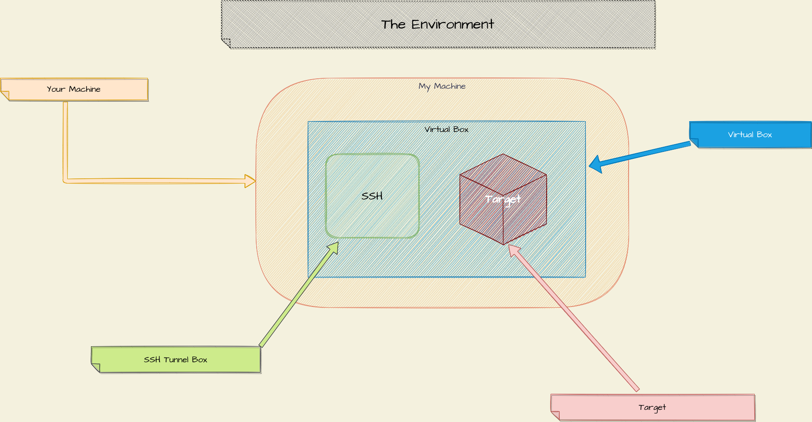
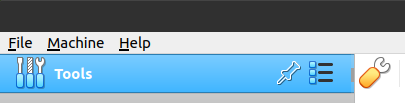
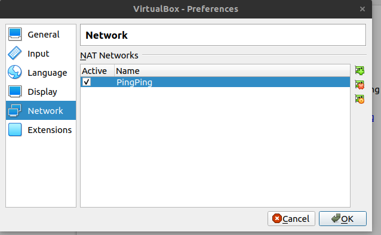
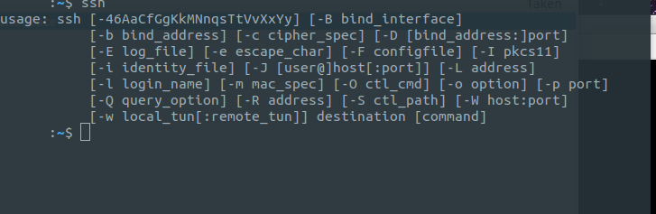
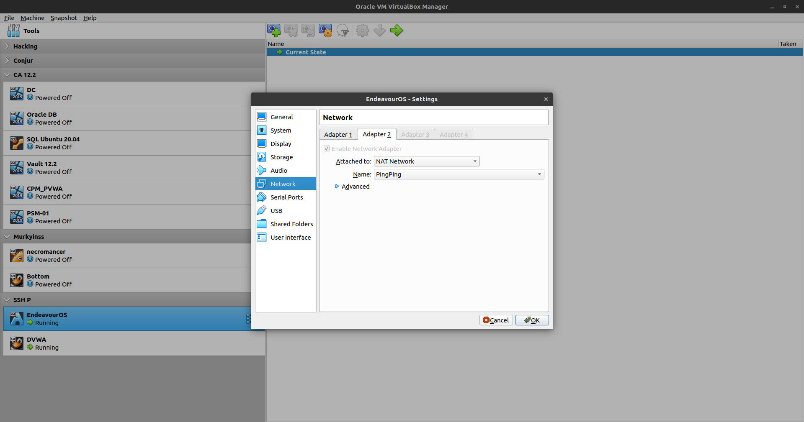
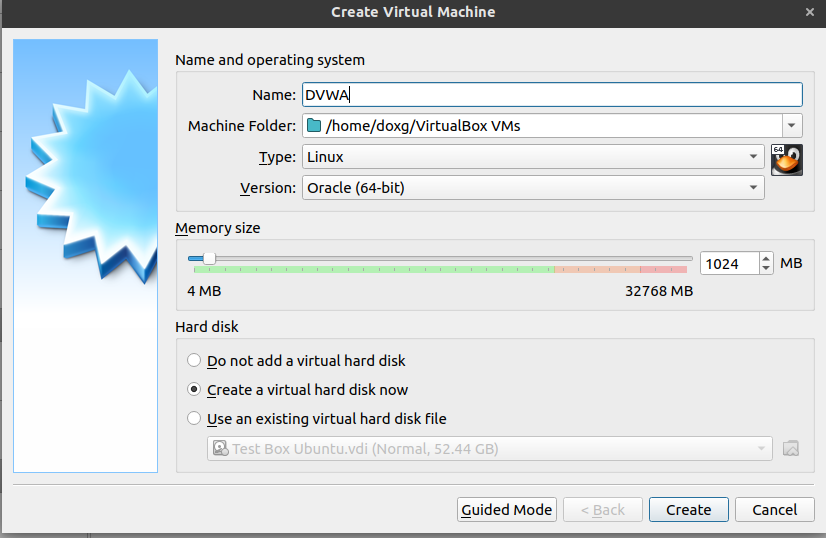
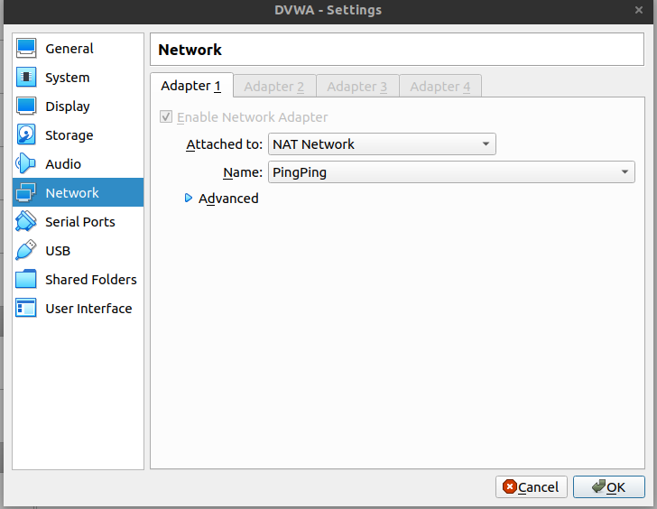
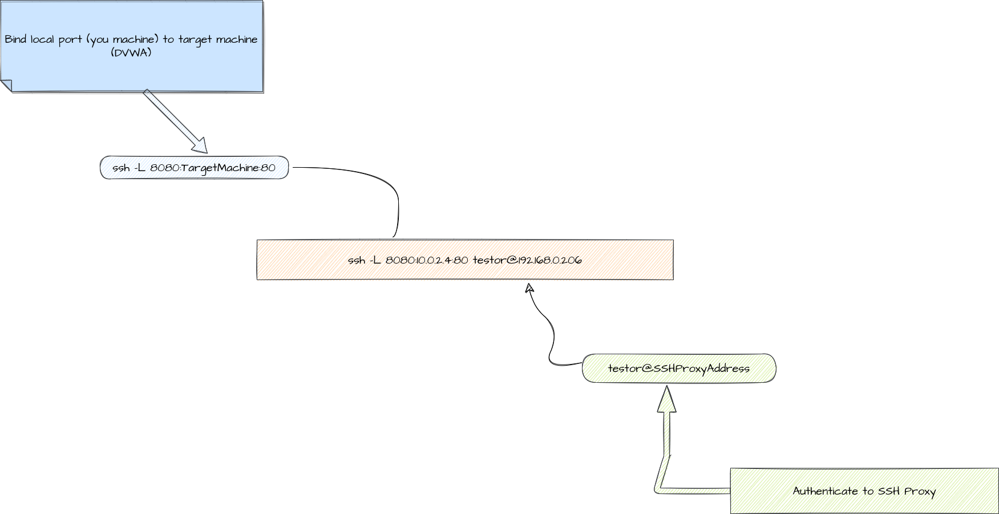
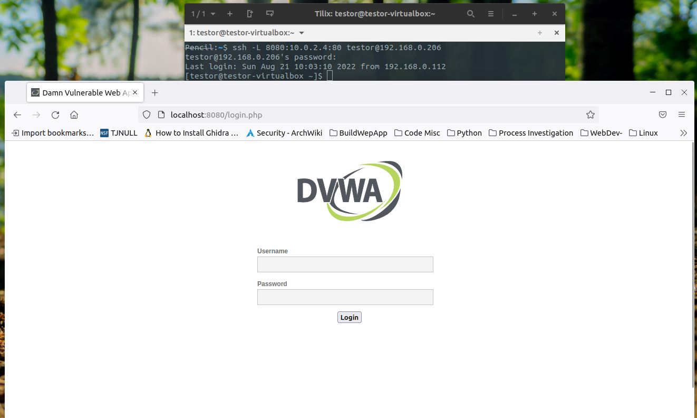

# SSH Proxy

### Introduction

I was a reading an article the other day and it mentioned SSH Tunnels/Proxies. I realized it has been a while since I created one. So I wanted to do a quick to refresher.

Fair warning I am assumming you understand how to create machines in VirtualBox and some basic networking/linux knowledge

Here is poor mans version of an SSH proxy

### Enviroment
* * *
MyMachine -----> Ubuntu

**Virtual Box is Hosting the Below Machines**

- SSH Tunnel	(Endevour OS) You can run any Linux Distro
- DVWA  Easy setup and I planned on attacking it later

I worked super hard on these drawings, and even though I think the enviroment pic helps put everything into a concise view. I wanted to convey how the traffic is working check out the super complex diagram below

MyMachine ----> SSH Box ----> Target 

### Virtual Box Configs

For this project we need to simulate isolatation from yourmachine --> target, easiest way I could think of was a NAT Network in VirtualBox

- Launch Virtual Box 
- Click on Tools --> Little Wrench (display global settings)

The Window below should appear

Here you need a create a Nat Network,for your DVWA Machine, simulates isolation, in my case I created the PingPing NetWork

### My Box ( Setup )

Whatever OS you are running make you have an SSH Installed
The quickest way to test is run `ssh`, in a terminal

###  Setting Up  the SSH Tunnel
* * *

I am running Endeavour OS, no particular reason just wanted to check out the distro, you can run any Linux Distro you wish. As long as you install OpenSSH

Here you can check out [EndeavourOS](https://endeavouros.com/)

I will provide the OpenSSH install instruction for **Ubuntu** because it way more common, gotta appeal to the masses and all. But don't get confused these instrtucitions are for the SSH Proxy node. Grant it  they would  100% work on my machine, which is also running Ubuntu

#### SSH Install On SSH Tunnel Box

- Log into to your SSH Proxy Box
- Launch a Terminal

Run the following commands

	- sudo apt-get install openssh-server
	- sudo systemctl enable ssh
	- sudo systemctl start ssh

You can test a Login from your machine by launching a terminal and running

`ssh usernameofsshbox@address-of-ssh-box`

**Last but not least make sure you had the NatNetwork(PingPing) to your SSH Proxy Box as a second adapter** 

First Adapter is set to Bridged Adapter, Second is NAT Network-Ping Ping

This ensures your SSH Proxy can talk to your host machine and your target machine

# Setting up DVWA 

I downloaded the ISO from Vulnhub [Link](https://www.vulnhub.com/entry/damn-vulnerable-web-application-dvwa-107,43/)

- Lauch Virtual Box
- Click Machine -> New

Use the below image as reference

- Click Create -> Create

**Before starting the Machine**

- Right Click --> Settings --> Network 

Configure the network settings as seen in the Image

- Click Ok

You should be all set

*Caution the DVWA Machine should automatically boot, but it might be worth it to ensure it came up correctly plus you will need to grab the ip address*

# Testing our POC

So now we need to whisper in the ear of our SSH Proxy and say. "Hey guy take anything from this door and send it to that door". When Mr.Proxy Starts asking why? Say, because I can't reach that door but you can.

In more technial terms

SSH tunnel

SSH tunneling, or SSH port forwarding, is a method of transporting arbitrary data over an encrypted SSH connection. SSH tunnels allow connections made to a local port (that is, to a port on your own desktop) to be forwarded to a remote machine via a secure channel.

[Link to Defeniton](https://www.concordia.ca/ginacody/aits/support/faq/ssh-tunnel.html)

Open a terminal on your machine and run the following. Remeber to adjust the ip addresses in the command to match your eniviroment 

ssh -L 8080:10.0.2.4:80 testor@192.168.0.206

Now that's all done

Open your broswer

Go to localhost:8080

TADA! You can now access the DVWA webpage 
